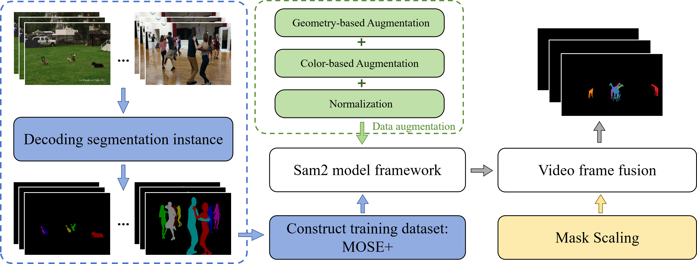

# CVPR 2025 - MOSE Track of the 4th PVUW challenge 2025：**2nd** 

# MASSeg : Multi-scale-Aware Segmentation Network for Complex Video Object Segmentation


<p align="middle">
    
</p>

## 🚧🚧🚧 We are currently organizing the code and will release the complete solution soon! After obtaining official approval from the challenge organizers
**Thank you for your understanding and support!** 

**Author:** Xuqiang Cao, Linnan Zhao, Jiaxuan Zhao, Fang Liu, Puhua Chen, Wenping Ma 

# Introduce
**MASSeg** is our 2nd place solution to the CVPR 2025 PVUW MOSE Challenge. It enhances a segmentation framework with mask scaling, MOSE-specific data augmentation, and the MOSE+ dataset, achieving a **J&F** score of **0.8628**. 
<p align="middle">
    
</p>

# Installation 
MASSeg needs to be installed first before use. The code requires `python>=3.10`, as well as `torch>=2.5.1` and `torchvision>=0.20.1`. Please follow the instructions [here](https://pytorch.org/get-started/locally/) to install both PyTorch and TorchVision dependencies. You can install MASSeg on a GPU machine using:

### Clone this repository

   ```bash
   git clone --depth 1 https://github.com/cxqNet/MASSeg.git  && cd MASSeg

   pip install -e .
   ```
# Getting Started
### Datasets Preparation
We integrated a new dataset "MOSE+" to improve the performance of the model in the training phase
The dataset "MOSE+" can be downloaded from this link of [BaiduPan]( https://pan.baidu.com/s/1pVRdRqkbX5gKf83YwnVc8Q?pwd=wc7n). Please place it in the `data` folder and confirm the file structure as follows:
```
MASSeg/
    |- data
        |- MOSE+
           |- JPEGImages
           |- Annotations
           |- moseplus.txt
    |- Training
    |- tools
    |- ...
```
### Download Pretrained Weights
We provide the pretrained model weights used in the CVPR 2025 PVUW MOSE Track. You can download them via the link below:
🔗 Baidu Netdisk Download Link: [BaiduPan]( https://pan.baidu.com/s/1pVRdRqkbX5gKf83YwnVc8Q?pwd=wc7n)

After downloading, please place the weights in the following directory:

```
MASSeg/
    |- checkpoints/
        │- mass_seg_mose.pth
```

# MOSE Challenge Organizers :

<!-- 第一行：主组织者 -->
<table align="center" cellspacing="10">
  <tr align="center">
    <td width="160px">
      <br>
      <a href="https://henghuiding.github.io/"><b>Henghui Ding</b></a><br>
      <i>Primary Organizer<br>Fudan University</i>
    </td>
    <td width="60px"></td> <!-- 空隔 -->
    <td width="160px">
      <br>
      <a href="https://scholar.google.com/citations?hl=en&authuser=1&user=XlQP0GIAAAAJ"><b>Chang Liu</b></a><br>
      <i>Primary Organizer<br>Nanyang Technological University</i>
    </td>
  </tr>
</table>

<br>

<!-- 第二行：其他组织者 -->
<table align="center" cellspacing="10">
  <tr align="center">
    <td width="160px">
      <br>
      <a href="https://heshuting555.github.io/"><b>Shuting He</b></a><br>
      <i>Nanyang Technological University</i>
    </td>
    <td width="40px"></td>
    <td width="160px">
      <br>
      <a href="https://personal.ntu.edu.sg/exdjiang/"><b>Xudong Jiang</b></a><br>
      <i>Nanyang Technological University</i>
    </td>
    <td width="40px"></td>
    <td width="160px">
      <br>
      <a href="https://www.robots.ox.ac.uk/~phst/"><b>Philip H.S. Torr</b></a><br>
      <i>University of Oxford</i>
    </td>
    <td width="40px"></td>
    <td width="160px">
      <br>
      <a href="https://songbai.site/"><b>Song Bai</b></a><br>
      <i>ByteDance</i>
    </td>
  </tr>
</table>

## References
We would like to thank the authors and contributors of [MOSE](https://github.com/henghuiding/MOSE-api), [Sam2](https://github.com/facebookresearch/sam2), and [Cutie](https://github.com/hkchengrex/Cutie), for their open-sourced code which significantly aided this project.
